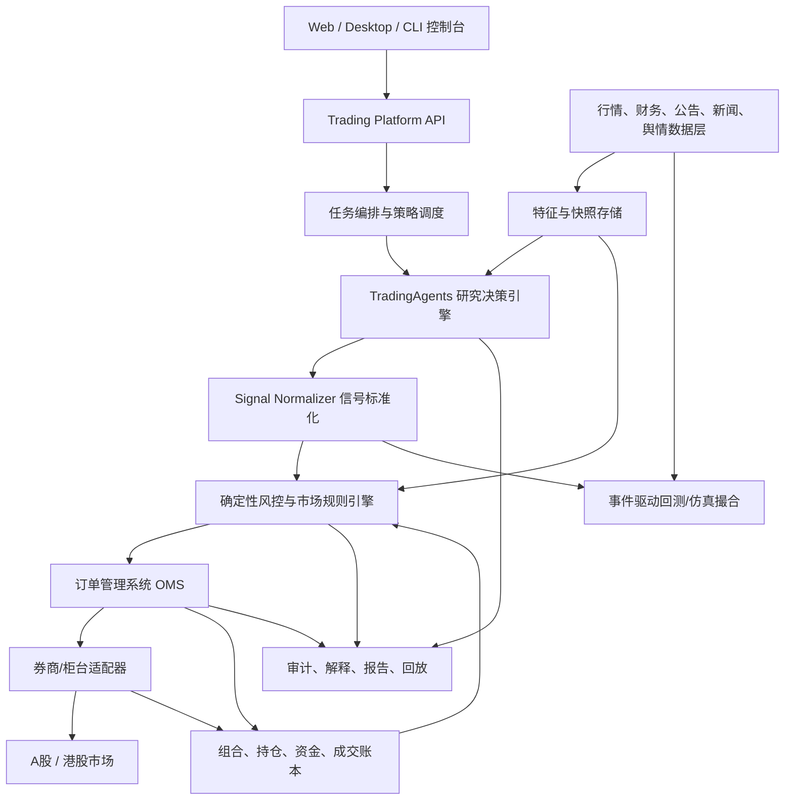

# A股与港股自动化交易工具平台设计

> 基于 `TauricResearch/TradingAgents` v0.3.0 代码与官方文档调研。本文是工程设计稿，不构成投资建议；任何实盘自动交易都必须经过合规、风控、仿真、灰度和人工授权。

## 1. 设计目标

构建一个面向 A 股与港股的自动化交易工具平台，将 TradingAgents 的多 Agent 研究框架改造成“研究决策引擎”，并在外层补齐真实交易所需的数据治理、市场规则、组合风控、订单执行、审计回放与回测仿真能力。

核心原则：

- LLM 只输出研究结论和建议，不直接下单。
- 所有可执行交易都必须经过确定性风控与市场规则引擎。
- 交易指令必须结构化、可解释、可回放、可人工干预。
- A 股与港股分市场建模，统一资产抽象，不强行套用美股/Yahoo Finance 逻辑。
- 先做“研究辅助 + 仿真交易”，再逐步进入“半自动实盘”，最后才允许小规模自动实盘。

## 2. TradingAgents 框架学习结论

### 2.1 当前框架能力

TradingAgents 是一个基于 LangGraph 的多 Agent 金融研究框架。官方 README 说明其角色包括基本面分析师、情绪分析师、新闻分析师、技术分析师、交易员、风险管理团队和组合经理；它定位为研究用途，不应直接视为投资建议。

代码里的关键结构：

- `tradingagents/graph/trading_graph.py`
  - `TradingAgentsGraph` 是主入口。
  - 初始化 LLM、数据工具、LangGraph 工作流、记忆日志、checkpoint。
  - `propagate(ticker, trade_date)` 返回最终状态和处理后的交易信号。
- `tradingagents/graph/setup.py`
  - 用 `StateGraph(AgentState)` 组装执行图。
  - 流程为：分析师链路 -> 牛熊研究员辩论 -> 研究经理 -> 交易员 -> 激进/中性/保守风控辩论 -> 组合经理。
- `tradingagents/agents/utils/agent_states.py`
  - 定义 `AgentState`，核心字段包括 `market_report`、`sentiment_report`、`news_report`、`fundamentals_report`、`investment_plan`、`trader_investment_plan`、`final_trade_decision`。
- `tradingagents/dataflows/interface.py`
  - 用 `route_to_vendor()` 做数据供应商路由。
  - 目前核心供应商为 `yfinance`、`alpha_vantage`、`fred`、`polymarket`。
- `tradingagents/default_config.py`
  - 已支持数据供应商配置、LLM 供应商配置、输出语言、checkpoint、benchmark 映射。
  - benchmark 已包含 `.HK -> ^HSI`、`.SS -> 000001.SS`、`.SZ -> 399001.SZ`。
- `tradingagents/agents/schemas.py`
  - 研究经理、交易员、组合经理已经有结构化输出。
  - 当前评级为 `Buy / Overweight / Hold / Underweight / Sell`，交易员动作为 `Buy / Hold / Sell`。

### 2.2 可直接复用的部分

- LangGraph 多 Agent 编排。
- 分析师、研究员、风控辩论、组合经理的组织方式。
- 结构化输出机制。
- `data_vendors` 与 `tool_vendors` 的供应商路由思想。
- checkpoint、decision log、report tree、memory reflection。
- 多 LLM provider 适配。
- `get_verified_market_snapshot()` 这种确定性行情快照思路。

### 2.3 必须改造的部分

- 数据层：`yfinance` 可以做原型，但不适合作为 A 股/港股实盘主数据源。
- 工具层：现有工具面向美股语境，需要加入 A/H 股专用工具。
- 信号层：当前最终决策是 Markdown 文本，需要转成强类型 `SignalIntent`。
- 风控层：LLM 风控辩论不能替代确定性风控。
- 执行层：当前没有券商接口、订单生命周期、成交回报、撤单、异常处理。
- 市场规则层：需要内置 A 股/港股交易时段、涨跌幅、手数、T+1、港股碎股/整手、Stock Connect 等规则。
- 回测层：需要事件驱动回测，而不是只在单一日期调用 Agent。

## 3. A股与港股市场约束

### 3.1 A股

交易时间与规则需要按交易所规则落地。上交所官方交易时间显示，股票有开盘集合竞价 `9:15-9:25`，连续竞价 `9:30-11:30` 与 `13:00-14:57`，收盘集合竞价 `14:57-15:00`。深交所英文页面也列出相同的开盘集合竞价、连续竞价和收盘集合竞价窗口。

关键规则：

- 主板普通 A 股最小买入单位通常为 `100` 股整数倍。
- 上交所主板 A 股价格最小变动单位为 `0.01` 元。
- 上交所主板普通股票日涨跌幅为 `10%`，风险警示股票为 `5%`。
- 科创板、创业板等板块存在 `20%` 等不同涨跌幅与订单数量约束。
- A 股股票卖出通常受 T+1 可用约束，买入后当日不可卖出。
- 需要区分沪市、深市、北交所、科创板、创业板、ST、退市整理、停牌、涨跌停、融资融券标的。

### 3.2 港股

港交所官方证券市场时间显示，港股有开市前时段 `9:00-9:30`、早市连续交易 `9:30-12:00`、午市连续交易 `13:00-16:00`，符合条件证券有收市竞价交易时段 `16:00` 至随机收市 `16:08-16:10`。

关键规则：

- 港股采用不同股票不同每手股数，不能默认 `100` 股。
- 价格档位随股价区间变化，需要按 HKEX tick table 计算。
- 支持限价盘、增强限价盘、特别限价盘、竞价盘、竞价限价盘等不同订单类型。
- 港股没有 A 股式统一 10% 涨跌停，但有 VCM、竞价阶段价格限制、卖空规则等。
- 需处理港币计价、部分 RMB 双柜台股票、印花税/交易费/平台费。
- 沪深港通南北向交易需要按 Stock Connect 可交易日、额度、订单输入窗口和标的名单限制。

## 4. 平台总体架构



建议采用“一个研究引擎 + 两套市场适配 + 一个统一交易内核”的结构：

- 研究引擎：沿用 TradingAgents，扩展 A/H 股工具与提示词。
- 数据中台：统一证券主数据、行情、公告、财务、新闻、舆情、宏观数据。
- 策略与信号服务：把 Agent 输出转换为可风控的结构化信号。
- 规则与风控引擎：确定性检查所有交易意图。
- OMS/EMS：管理订单生命周期与券商适配。
- 回测/仿真：在同一套信号、规则、OMS 接口上模拟交易。
- 运维审计：保存每次 Agent 输入、工具调用、模型输出、风控拒绝原因、订单状态。

## 5. 核心领域模型

### 5.1 Instrument

```python
class Instrument:
    symbol: str              # 600519.SH, 000001.SZ, 0700.HK
    market: str              # CN_SH, CN_SZ, HK
    asset_class: str         # stock, etf, reit, cbond
    board: str               # main, star, chinext, st, hk_main
    currency: str            # CNY, HKD, CNH
    lot_size: int            # A股多为100，港股按证券变化
    tick_size_rule: str
    price_limit_rule: str | None
    settlement_rule: str     # A股股票 T+1；港股按 CCASS/券商口径
    tradable: bool
```

### 5.2 SignalIntent

Agent 输出必须转成强类型信号：

```python
class SignalIntent:
    run_id: str
    strategy_id: str
    symbol: str
    market: str
    side: str                # BUY, SELL, HOLD, REDUCE, INCREASE
    conviction: float        # 0.0 - 1.0
    target_weight: float | None
    max_notional: float | None
    entry_price: float | None
    stop_loss: float | None
    take_profit: float | None
    time_horizon: str | None
    rationale: str
    evidence_refs: list[str]
```

### 5.3 OrderIntent 与 Order

```python
class OrderIntent:
    signal_id: str
    account_id: str
    symbol: str
    side: str
    order_type: str          # LIMIT, MARKET, ENHANCED_LIMIT, AUCTION
    quantity: int
    limit_price: float | None
    tif: str                 # DAY, IOC, FOK
    source: str              # agent, manual, rebalance

class Order:
    order_id: str
    broker_order_id: str | None
    status: str              # NEW, SUBMITTED, PARTIALLY_FILLED, FILLED, CANCELLED, REJECTED
    filled_qty: int
    avg_price: float | None
    reject_reason: str | None
```

## 6. 模块设计

### 6.1 数据层

生产数据建议分层：

- 主数据
  - A 股：交易所证券列表、板块、ST 状态、停复牌、涨跌停、融资融券、行业分类。
  - 港股：HKEX 标的、每手股数、tick size、双柜台、可卖空标记、CAS/VCM 标记。
- 行情数据
  - 日线、分钟线、实时 quote、逐笔/盘口。
  - 原型可用 AkShare/Tushare/yfinance，生产应接 Wind/Choice/聚宽/RiceQuant/交易所授权行情/券商行情。
- 财务与公告
  - A 股：巨潮资讯、上交所/深交所公告、财报、业绩预告、股权质押、限售解禁。
  - 港股：HKEXnews、年报中报、公告、权益披露。
- 新闻与舆情
  - 财联社、证券时报、同花顺、东方财富股吧、雪球、公司公告摘要、研报摘要。
- 宏观与资金
  - 人民银行、国家统计局、外汇局、北向/南向资金、两融、行业资金流。

新增 dataflows 建议：

```text
tradingagents/dataflows/
  cn_market.py
  cn_fundamentals.py
  cn_announcements.py
  cn_news.py
  hk_market.py
  hk_fundamentals.py
  hk_announcements.py
  hk_news.py
  market_rules.py
```

同时扩展 `VENDOR_METHODS`：

```python
"get_cn_stock_data": {"tushare": ..., "akshare": ..., "wind": ...}
"get_hk_stock_data": {"hkex": ..., "futu": ..., "yfinance": ...}
"get_cn_announcements": {"cninfo": ..., "sse": ..., "szse": ...}
"get_hk_announcements": {"hkexnews": ...}
"get_board_lot": {"hkex": ..., "broker": ...}
"get_price_limit": {"exchange_rules": ...}
```

### 6.2 Agent 扩展

保留当前四类分析师，但针对 A/H 股改写工具与上下文：

- Market Analyst
  - 加入涨跌停、盘口深度、换手率、量比、融资融券、北向/南向资金、AH 溢价。
- Fundamentals Analyst
  - A 股：ROE、扣非净利、现金流、商誉、应收账款、存货、股权质押、解禁。
  - 港股：港币财报口径、分红、回购、H 股/红筹/民企/国企属性。
- News Analyst
  - 公司公告优先级高于媒体新闻。
  - 加入监管问询、处罚、停复牌、业绩预告、重大合同、并购重组。
- Sentiment Analyst
  - A 股舆情用雪球、股吧、龙虎榜、涨停板情绪。
  - 港股舆情用 HKEXnews、主流财经媒体、南向资金、窝轮/牛熊证异常活跃作为辅助。

建议新增 Agent：

- `Regulatory Analyst`
  - 识别停牌、ST、退市风险、监管问询、重大诉讼、财报非标意见。
- `Liquidity Analyst`
  - 评估盘口深度、成交额、冲击成本、是否适合自动下单。
- `Corporate Action Analyst`
  - 处理分红、送转、配股、拆股、除权除息、港股供股。
- `A-H Premium Analyst`
  - 对同时有 A/H 股的公司，分析 AH 溢价、汇率、资金流和估值差。

### 6.3 信号标准化

当前 `SignalProcessor` 从文本里提取核心决策，只适合展示。实盘平台应新增：

```text
research markdown
  -> structured PortfolioDecision
  -> SignalIntent
  -> deterministic validation
  -> OrderIntent
```

Signal Normalizer 规则：

- `Buy` / `Overweight` 转为增持意图，但必须给出目标权重上限。
- `Underweight` / `Sell` 转为减持/卖出意图，但 A 股检查 T+1 可卖数量。
- `Hold` 永不生成订单，除非组合再平衡模块另有确定性指令。
- 缺少价格、仓位、时间周期、置信度时，只进入人工确认队列。
- LLM 给出的价格如果偏离最新盘口或涨跌停区间，强制拒绝或重算。

### 6.4 市场规则引擎

规则引擎是平台安全核心，必须确定性实现：

```text
MarketRuleEngine
  validate_session()
  validate_symbol_status()
  validate_order_type()
  validate_lot_size()
  validate_tick_size()
  validate_price_limit()
  validate_sellable_quantity()
  validate_cash_available()
  validate_stock_connect_eligibility()
  validate_short_sell()
```

A 股规则检查：

- 是否交易日、是否在可接受委托时段。
- 是否停牌、退市整理、ST、风险警示。
- 买入数量是否 `100` 股整数倍；卖出零股是否符合规则。
- 价格是否符合 tick size 和涨跌停。
- 是否具备可用资金、可卖持仓。
- 当日买入股票不可卖出。
- 科创板/创业板/北交所单独规则表。

港股规则检查：

- 是否交易日，是否处于 POS/CTS/CAS 对应订单类型窗口。
- 每手股数、碎股订单限制。
- tick size 是否符合港交所价位表。
- 增强限价盘/特别限价盘价格限制。
- CAS 证券与价格限制。
- VCM 冷静期状态。
- 卖空标的与卖空申报规则。
- 双柜台币种与账户资金币种检查。

### 6.5 风控引擎

确定性风控在 Agent 风控之后执行：

- 账户级
  - 单账户最大仓位、最大杠杆、最大现金占用。
  - 单日最大亏损、单日最大交易额、最大撤单率。
- 标的级
  - 单票最大仓位、行业集中度、流动性下限。
  - 黑名单、灰名单、停牌/ST/监管风险。
- 订单级
  - 最大单笔金额、价格偏离、预计冲击成本、盘口成交概率。
  - 禁止追涨停/跌停扫单，或需要人工确认。
- 策略级
  - Agent 信号置信度阈值。
  - 冷却期：同一标的 N 分钟内不重复开仓。
  - 冲突检测：多个 Agent/策略对同一标的方向冲突时合并或拒绝。
- 熔断级
  - 行情源异常、订单回报延迟、券商连接异常、净值异常、模型异常输出时自动降级到只读/只撤单模式。

### 6.6 OMS/EMS

OMS 管订单生命周期，EMS 管执行策略：

- OMS
  - 创建订单、提交、撤单、改价、成交回报、订单状态机。
  - 幂等提交：每个 `OrderIntent` 有唯一 `client_order_id`。
  - 断线恢复：从券商侧拉取未完成订单并重建状态。
- EMS
  - 小单：限价单/增强限价单直接挂单。
  - 大单：TWAP/VWAP/盘口被动挂单。
  - 涨跌停或 CAS：特殊执行模板。
  - 不允许 LLM 决定执行切片细节，只允许它给方向和理由。

券商适配器建议：

- A 股
  - QMT / XtQuant、PTrade、券商极速柜台、恒生/顶点柜台接口，按实际账户可得性选择。
- 港股
  - Futu OpenD、Interactive Brokers、Tiger、Longbridge、券商 FIX/API。

接口抽象：

```python
class BrokerGateway:
    def get_account(self) -> AccountSnapshot: ...
    def get_positions(self) -> list[Position]: ...
    def get_quote(self, symbol: str) -> Quote: ...
    def submit_order(self, order: OrderIntent) -> BrokerOrderAck: ...
    def cancel_order(self, broker_order_id: str) -> CancelAck: ...
    def stream_order_events(self): ...
```

## 7. 回测与仿真

回测必须复用同一套 `SignalIntent -> Risk -> OMS` 流程：

- 历史数据回放：日线、分钟线、逐笔/盘口。
- 事件驱动：开盘、集合竞价、新闻公告、财报、Agent 决策、下单、成交。
- 仿真撮合：
  - A 股涨跌停、T+1、停牌、最小手数。
  - 港股每手股数、tick size、交易时段、滑点。
- 成本模型：
  - 佣金、印花税、过户费、交易征费、平台费、汇率。
- 评价指标：
  - 年化收益、最大回撤、波动率、夏普、胜率、换手率、冲击成本、相对指数 alpha。
- Agent 成本：
  - 模型 token 成本、数据 API 成本、延迟、失败率。

建议分三种模式：

- `research_only`：只生成报告，不生成订单。
- `paper_trading`：生成订单并在仿真账户成交。
- `live_guarded`：生成实盘订单意图，但默认需要人工确认。
- `live_auto`：仅对白名单策略、白名单标的、小额度启用。

## 8. 服务拆分

推荐先用单体模块化，后续再拆服务：

```text
apps/
  api/                  # FastAPI 管理端 API
  worker/               # Celery/Arq/RQ 后台任务
  web/                  # React/Vue 控制台

trading_platform/
  research/             # TradingAgents 包装器
  signals/              # 信号标准化
  market_data/          # 数据接入与快照
  market_rules/         # A/H 规则引擎
  risk/                 # 风控
  portfolio/            # 持仓、现金、账本
  oms/                  # 订单状态机
  brokers/              # 券商适配器
  backtest/             # 回测与仿真
  audit/                # 审计、报告、回放
```

基础设施：

- PostgreSQL：订单、持仓、任务、审计、主数据。
- TimescaleDB/ClickHouse：行情、特征、回测事件。
- Redis：任务队列、行情快照缓存、分布式锁。
- Object Storage：报告、原始公告、模型输入输出归档。
- Prometheus/Grafana：延迟、失败率、订单状态、风控拒绝率。
- OpenTelemetry：跨 Agent、数据、风控、订单链路追踪。

## 9. UI 设计

第一屏应该是交易控制台，而不是营销页：

- 顶部：账户净值、现金、今日盈亏、风险状态、实盘开关。
- 左侧：市场、策略、任务、组合、订单、报告、审计。
- 主区域：
  - Watchlist：A 股/港股列表、状态、涨跌幅、成交额、Agent 评级。
  - Signal Queue：待审批信号，展示理由、证据、风险检查结果。
  - Order Blotter：订单状态、撤单、重试、异常。
  - Portfolio：持仓、行业暴露、市场暴露、单票风险。
  - Research Report：TradingAgents 全链路报告。
- 风险面板：
  - 今日触发规则、拒单原因、熔断状态、行情源健康度。

## 10. 与现有代码的改造路线

### 阶段一：A/H 研究版

目标：不下单，只让 TradingAgents 正确理解 A/H 股。

- 增加 `InstrumentResolver`，支持 `600519.SH`、`000001.SZ`、`0700.HK`。
- 扩展 `default_config.py`：
  - `market_region`
  - `cn_data_vendors`
  - `hk_data_vendors`
  - `market_rules_vendor`
- 新增 A/H 数据工具并接入 `route_to_vendor()`。
- 改写分析师 prompt，加入 A/H 股制度、公告优先、货币单位、手数。
- 扩展 `PortfolioDecision`，加入 `conviction`、`target_weight`、`risk_flags`。
- 只输出报告和结构化 `SignalIntent`。

### 阶段二：仿真交易版

目标：生成订单意图，但只在 paper account 成交。

- 新建 `trading_platform` 包。
- 实现 `SignalNormalizer`。
- 实现 `MarketRuleEngine`。
- 实现 `RiskEngine`。
- 实现 paper `BrokerGateway`。
- 建立 `orders`、`positions`、`fills`、`signals`、`audit_logs` 表。
- 实现回测/仿真撮合。

### 阶段三：半自动实盘

目标：Agent 生成信号，人工审批后下单。

- 接入一个 A 股券商适配器和一个港股券商适配器。
- 所有订单默认进入人工确认队列。
- 每次下单前显示：
  - Agent 结论
  - 风控结果
  - 预计价格/滑点/费用
  - 可卖数量/可用资金
  - 最坏情形损失
- 支持一键批准、一键拒绝、一键降仓位。

### 阶段四：小额度自动实盘

目标：只对白名单策略、白名单账户、白名单标的小额度自动。

- 每日自动交易额度上限。
- 单票自动交易额度上限。
- 连续亏损自动暂停。
- 行情/券商/模型异常自动切只读。
- 定时生成复盘报告。

## 11. 最小可行版本

MVP 建议范围：

- 市场：A 股主板 + 港股主板。
- 标的：用户自选 50-200 只。
- 数据：日线 + 分钟线 + 公告 + 财报 + 新闻。
- 频率：盘前批量研究，盘中只做风控与订单管理。
- 交易：paper trading。
- 模型：中文输出，低温度，结构化输出强校验。
- 执行：不接实盘，先跑 1-3 个月仿真。

MVP 任务链：

```text
每日 07:30 拉取公告/新闻/财报
每日 08:30 更新候选池和风险状态
每日 08:45 TradingAgents 批量生成研究报告
每日 09:10 SignalNormalizer 生成候选信号
每日 09:15 MarketRuleEngine + RiskEngine 过滤
盘中根据盘口生成 paper orders
收盘后计算成交、持仓、PnL、归因
晚上生成复盘和下一交易日关注列表
```

## 12. 关键风险

- 数据风险：免费数据源延迟、不完整、复权不一致、公告解析错误。
- 模型风险：幻觉、过度自信、对交易制度理解错误。
- 执行风险：券商 API 断线、重复下单、撤单失败、成交回报延迟。
- 市场风险：涨跌停、停牌、流动性枯竭、跳空、黑天鹅。
- 合规风险：自动化交易权限、账户授权、数据授权、日志留存。
- 安全风险：API key 泄露、越权下单、提示注入污染公告/新闻内容。

硬性保护：

- 默认不开实盘。
- 默认需要人工批准。
- 默认禁止市价扫单。
- 默认不在数据异常时下单。
- 默认保留完整输入、输出、风控与订单审计。

## 13. 官方来源

- TradingAgents GitHub README: https://github.com/TauricResearch/TradingAgents
- TradingAgents 文档站: https://tradingagents-ai.github.io/
- 上交所交易机制: https://english.sse.com.cn/start/trading/mechanism/
- 上交所交易时间: https://english.sse.com.cn/start/trading/schedule/
- 深交所交易概览: https://www.szse.cn/English/services/trading/tradOverview/index.html
- 港交所证券市场交易时间: https://www.hkex.com.hk/Services/Trading-hours-and-Severe-Weather-Arrangements/Trading-Hours/Securities-Market?sc_lang=en
- 港交所交易机制: https://www.hkex.com.hk/Services/Trading/Securities/Overview/Trading-Mechanism?sc_lang=en

